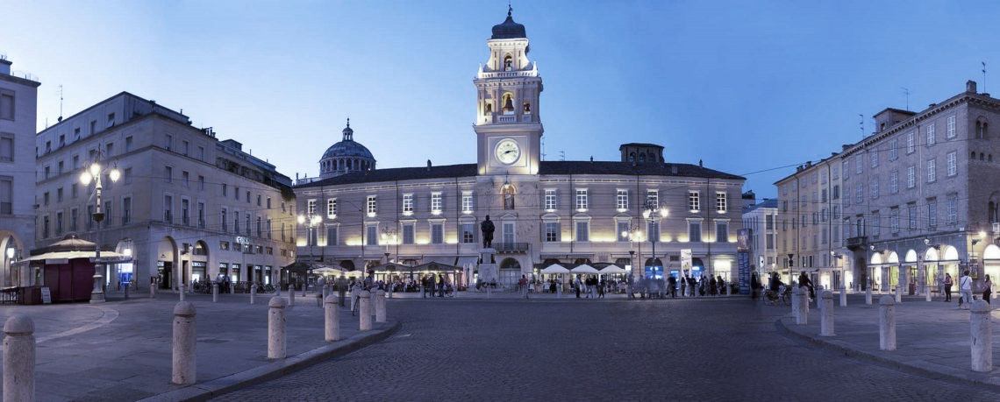

********************************************************************************
ESN-ASSI Parma
********************************************************************************

..   :height: 500px
..   :width: 394 px
   :scale: 50%
   :alt: img
   :align: center

Cosa è ESN-ASSI Parma?
================================================================================

ESN-ASSI Parma è un'associazione studentesca che si occupa sia degli studenti
stranieri che trascorrono un periodo di studio presso l'Università di Parma,
sia di quelli italiani che vogliono arricchire il loro curriculum universitario
con un'esperienza di studio presso una Università europea.

Costituita da volontari, prevalentemente ex-studenti Erasmus, ESN-ASSI Parma
svolge attività  d'informazione, accoglienza e supporto agli studenti stranieri
presenti a Parma, favorendo il loro inserimento iniziale, aiutandoli nei loro
rapporti con l'Università e incoraggiando un costante scambio socio-culturale
con gli studenti italiani.

ESN-ASSI Parma fa inoltre parte di due network no-profit: ESN (Erasmus Student
Network) Italia e ESN International; questo le permette di coordinare le sue
attività con quelle di altre associazioni universitarie in Italia e all'estero.

From the 90' to...
================================================================================

La nostra sezione nasce il 17 Settembre 1991. E' una delle “7 sorelle” che ha
fondato, nel 1992, ESN Italia di cui è anche sede legale.
L'associazione è ufficialmente riconosciuta dall'Università degli Studi di Parma
e, da qualche anno, è diventata anche un'Associazione di Promozione Sociale.

Composta da circa 20-25 membri attivi, ESN-ASSI Parma si è da sempre impegnata
nel promuovere l'integrazione degli studenti stranieri e lo scambio
interculturale tramite le proprie attività.
Ogni persona, pur con esperienze molto differenti tra loro,condivide lo stesso
principio, quello di accogliere gli studenti in scambio, trasmettendo i valori
della nostra cultura, avvicinandoci ai loro. Oltre agli studenti provenienti da
tutta Europa grazie al progetto Erasmus, la sezione da un costante supporto
anche agli studenti americani che arrivano dal Pitzer College e Boston College,
tramite apposite borse di studio ed altri programmi di scambio.

La sezione ESN-ASSI Parma è stata una delle prime ad attuare anche attività
riguardanti il Social Erasmus e, nel tempo, i “progetti-Social” sono aumentati
e coinvolgono sempre più studenti erasmus. Dai giochi con i bambini della casa
protetta alla pulizia del fiume, dalla visita al Canile Comunale ad Erasmus in
Schools; il Social Erasmus è parte integrante della vita della sezione e dei
suoi erasmus.

Grazie poi all'impegno ed alle capacità dei suoi attivi, la sezione ha raggiunto
nel tempo grandi obiettivi e riconoscimenti a livello nazionale ed
internazionale. Ha ospitato ben 7 PN, il titolo di “Best Section of the year”
all'AGM di Gdansk (2005). Diversi attivi hanno ricoperto ruoli nel board e, più
in generale, nel network di ESN Italia.

Anche a livello internazionale Parma è riuscita a dimostrare il proprio valore
ospitando nel 2000 l'executive board meeting e nel 2004 l'international board
meeting.

Ma i rapporti veri e naturali che si instaurano tra attivi e studenti erasmus,
sono il riconoscimento più bello che può vantare questa sezione.
