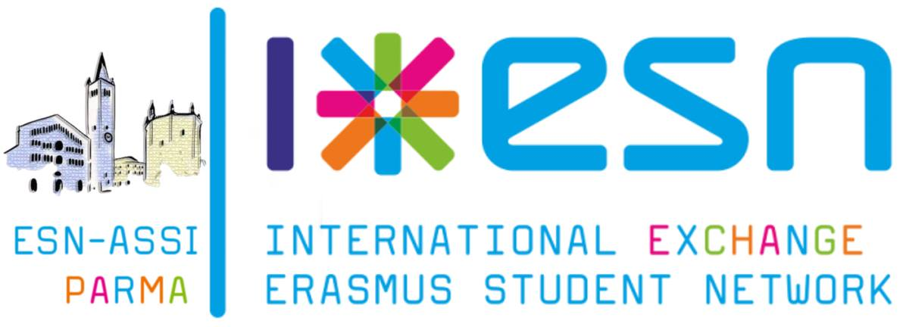

Wiki ESN-ASSI Parma
===============================================================================

..   :height: 500px
..   :width: 394 px
   :scale: 10 %
   :alt: esn-assi-wiki
   :align: center

La Wiki di ESN-ASSI Parma è una collezione di documenti, link utili,
raccomandazioni e guide raccolte al fine di aiutare sia il board entrante
che gli attivi che, per qualsiasi motivo, abbiano bisogno di informazioni
riguardo l’associazione su uno dei temi trattati.

La Wiki, multimediale e consultabile apertamente e senza vincolo alcuno,
dispone sia di un comodo modulo di ricerca che di un indice che viene
aggiornato con ogni nuovo articolo approvato.
Alla stesura dell’introduzione la responsabilità della Wiki e dei contenuti
in essa reperibili è sotto la tutela del board vigente e del web master.

Buon divertimento!

TODO
--------------------------------------------------------------------------------

Ruoli nell'associazione
 * Board (metterei tutti i board)
 * Incarichi/compiti board e board supporter (attivi, come si diventa etc)
 * Statuto / regolamento interno
 * Esncard / documenti convenzioni / come farle ecc
 * Ufficio (cosa c'è , cosa non c'è )

Progetti:
 * Help 4 Erasmus
 * Eurodinner
 * Social e exchange ability
 * Tandem
 * Cineforum
 * Tornei sportivi
 * Tite

Nazionale
 * Qualcosa!

Comunicazione
 * ML
 * Asana
 * Perché non usare Whatsapp
 * Faccialibro
 * Altri social

Welcome days
 * Banchetti ( promozione associazione/ sim wind)
 * Slides conference
 * Università di Parma

Viaggi con esn
 * come si organizzano ecc , discorso fee, file bilancio ecc
 * Creerei una sezione/cartella dove poter inserire tutti i resoconti bilanci anni passati!! È importante che la gente inizi a scrivere resoconto che comprendano tutti i dettagli (nomi hotel, ristoranti scelti e i corrispettivi menù con costo)

Contenuti
===============================================================================

.. toctree::
   :maxdepth: 2

   esn-assi-parma.rst
   i-ruoli-nell-associazione.rst
   i-compiti-del-board.rst
   mailing-list.rst
