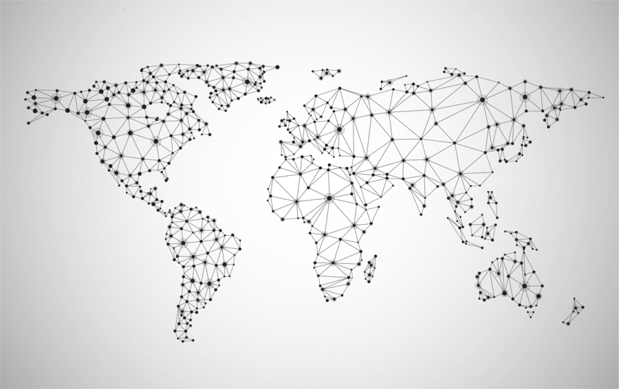
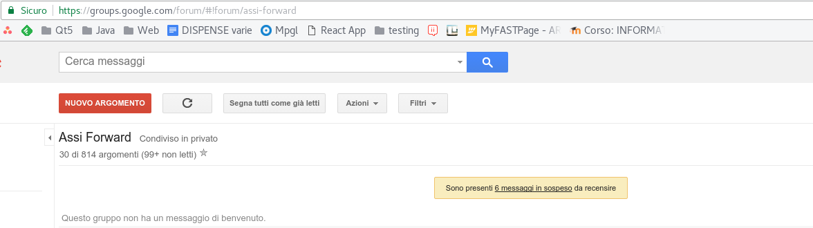

********************************************************************************
Mailing List
********************************************************************************

..   :height: 500px
..   :width: 394 px
   :scale: 10 %
   :alt: esn-assi-wiki
   :align: center

Cos'è una Mailing List
================================================================================

Estratto da *Wikipedia*

   *La mailing list (...) è un servizio/strumento (...) per la
   distribuzione di informazioni utili agli interessati/iscritti attraverso
   l'invio di email ad una lista di indirizzi di posta elettronica di utenti
   iscritti.*

Detto in parole più povere. Una lista di partecipanti, chiunque invia una email
all'indirizzo centrale scrive contemporaneamente a tutti.

Le Mailing List di ESN-ASSI Parma
================================================================================

Poiché l'associazione vanta molti iscritti, ognuno di natura diversa, nel corso
del tempo abbiamo ritenuto opportuno dedicare una mailing list per ogni macro-gruppo
di utenti.

Alla stesura della Wiki, il provider principale del servizio mailing list è google,
sotto la sezione google-gruppi. Google non è l'unico, nel passato ad esempio si
utilizzava Yahoo e per un breve lasso di tempo si è considerato di iscriverci a
delle ML gestite dall'Università di Parma.

ASSI Attivi
--------------------------------------------------------------------------------

* **Criterio d'uso**: Scambio d'informazione tra gli attivi
* **Indirizzo**: assi-attivi@googlegroups.com
* **Chi la usa**: Riservata agli attivi di sezione
* **Permessi**: Chiunque è iscritto può mandare un'email liberamente
* **Moderazione**: A cura del board

ASSI Info
--------------------------------------------------------------------------------

* **Criterio d'uso**: Invio email settimanale e call riunione agli associati italiani
* **Indirizzo**: assi-info@googlegroups.com
* **Chi la usa**: Riservata agli associati italiani
* **Permessi**: Chiunque è iscritto riceve, può inviare solo board e RC
* **Moderazione**: A cura del board e RC

Erasmus Parma
--------------------------------------------------------------------------------

* **Criterio d'uso**: Invio email settimanale agli associati erasmus
* **Indirizzo**: erasmus-parma@googlegroups.com
* **Chi la usa**: Riservata agli associati erasmus
* **Permessi**: Chiunque è iscritto riceve, può inviare solo board e RC
* **Moderazione**: A cura del board e RC

Board ESN Parma
--------------------------------------------------------------------------------

* **Criterio d'uso**: Scambio d'informazione tra i membri del board
* **Indirizzo**: boardesnparma@googlegroups.com
* **Chi la usa**: Riservata ai membri del board
* **Permessi**: Chiunque è iscritto può mandare un'email liberamente
* **Moderazione**: A cura del board

Assi UNIPR & "Il Forward"
--------------------------------------------------------------------------------

L'indirizzo ufficiale dell'ASSI è assi@unipr.it, qualunque messaggio venga
inviato a questo indirizzo viene inoltrato al forward.

* **Criterio d'uso**: Ricezione e ridirezione di posta da assi@unipr.it
* **Indirizzo**: assi-forward@googlegroups.com
* **Chi la usa**: Riservata ai qualsiasi attivo ne faccia domanda
* **Permessi**: Chiunque è iscritto può ricevere
* **Moderazione**: Segretario e volendo presidente

Come moderare il Forward
^^^^^^^^^^^^^^^^^^^^^^^^^^^^^^^^^^^^^^^^^^^^^^^^^^^^^^^^^^^^^^^^^^^^^^^^^^^^^^^^

All'alba dei tempi il server dell'università
ridirigeva tutta la posta a una lista di persone (il forward) e ad ogni
inserimento/cancellazione la lista veniva aggiornata.

Per motivi di comodità e per problemi di spam si è arrivati ad oggi a usare la ML
forward. Google in genere fornisce buoni filtri contro lo spam, alcune volte però
è necessario moderare personalmente l'inoltro.

Recarsi sulla pagina google del gruppo forward e verificare che ci siano effettivamente
dei messaggi in sospeso che richiedono moderazione manuale. Oppure spostarsi su:
https://groups.google.com/forum/?hl=it#!pendingmsg/assi-forward

------------

..   :height: 500px
..   :width: 394 px
   :scale: 10 %
   :alt: esn-assi-wiki
   :align: center

------------

Utilizzare i seguenti comandi dopo aver selezionato le email da moderare:

 * **Accetta**: Accetta per questa volta l'email
 * **Posta e consenti sempre**: Accetta sempre da questa fonte
 * **Rifiuta e segnala**: Rifiuta e non chiedere mai più da questa fonte
 * **Rifiuta**: Rifiuta per questa volta l'email

------------

 ..  image:: img/forward-accetta.png
 ..   :height: 500px
 ..   :width: 394 px
    :scale: 10 %
    :alt: esn-assi-wiki
    :align: center

------------

Spam
================================================================================

Da ultimo, una piccola nota sullo spam. Tutti, almeno una volta, sono tentati
di usare le email dalla ML per mandare semplici raccomandazioni come "Bravi tutti!" o
simili messaggi privi di contenuto.

Ricordiamoci che non stiamo usando una chat. In secondo luogo
ogni messaggio rappresenta una email che deve essere letta da tutti i partecipanti,
alcuni dei quali non usano gmail o non hanno gli strumenti per leggerle in modo
scorrevole. Se tutti gli attivi spammassero la mailing list diventerebbe un inferno,
quindi, se proprio dovete congratularvi con qualcuno o dire una boiata, abbiate
per lo meno l'accortezza di mandare il messaggio al diretto interessato invece che
a tutta la sezione!
