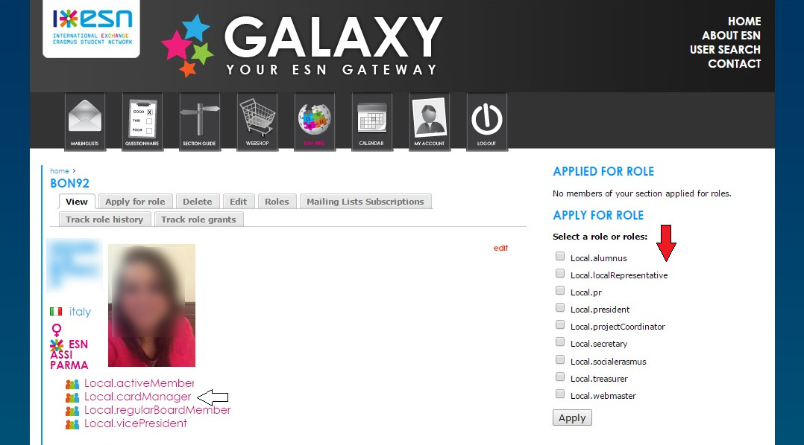
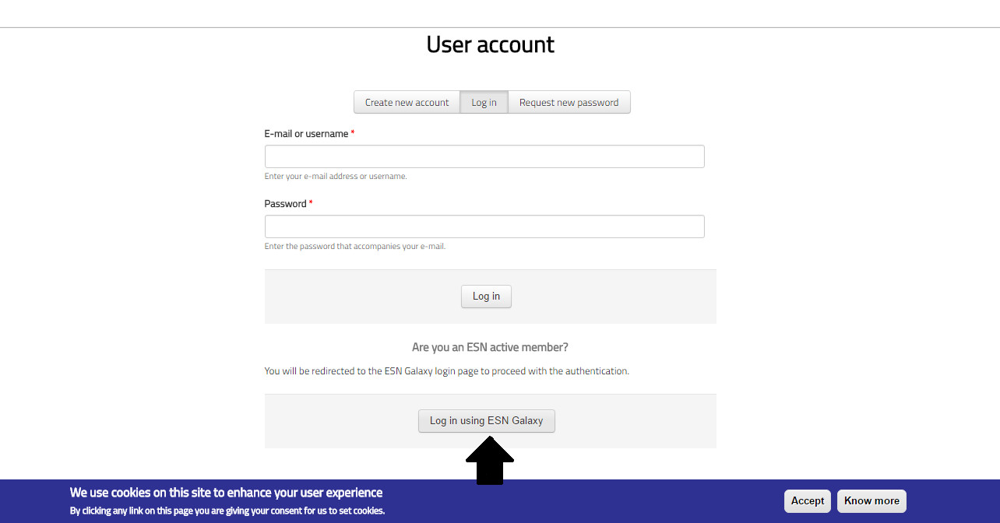
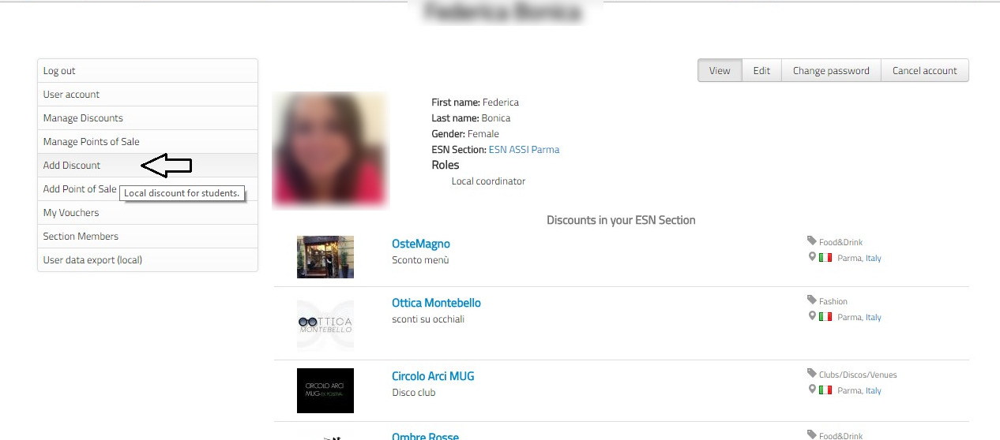

********************************************************************************
Compiti del Vicepresidente
********************************************************************************

..   :height: 500px
..   :width: 394 px
   :scale: 10 %
   :alt: esn-assi-wiki
   :align: center

.. _Calendario:

Calendario
################################################################################

Il calendario viene preparato prima dell'inizio di ogni semestre e comprende
tutte le attività che l'associazione prevede di compiere.
Es: Welcome Days, viaggi, Social Week...

.. Note:: Da fare **prima** dell'inizio di ogni semestre

* E' fondamentale per distribuire le attività in modo omogeneo evitando sovrapposizioni.

* Serve per la realizzazione della locandina della sezione pre-Welcome
  Days che aiuterà gli attivi a promuovere l'associazione e le suddette attività
  nel periodo dell'arrivo degli studenti Erasmus e Exchange a Parma.

Moderatore Assemblea Associativa
################################################################################

Altro compito del Vice, è mantenere la disciplina durante l'assemblea.

* Richiamare all'attenzione: gli associati spesso non interessati all'argomento
  si perdono in chiacchiere e vanno richiamati.

* Speaker's list: durante i dibattiti sarebbe opportuno che la gente alzasse la
  mano per chiedere la parola. Un'ottima idea è di scrivere una lista delle alzate
  di mano per ricordarsi l'ordine.

* Stare sul punto: Spesso durante i dibattiti la gente divaga. Aiuta l'assemblea
  a stare sul punto fino alla presa di una decisione. Questo non solo aiuta il segretario
  ma dà all'assemblea organicità.

Cardmanager
################################################################################

Il Cardmanager ha la gestione gli sconti associati alla sezione e in genere il
compito è affidato al vicepresidente.

Le Convenzioni
================================================================================

Ogni sezione di ESN ha un numero X di convenzioni, ovvero di accordi, presi per
iscritto, con attività commerciali presenti nella propria località che si impegnano
ad offrire vantaggi ai possessori di ESNcard, in cambio di una sponsorizzazione
del loro locale.

La durata massima di ogni convenzione è di 365 giorni dal giorno in cui viene firmata.
Al momento della stipulazione, ci devono essere due copie della convenzione, una per il
proprietario dell'attività commerciale e una per l'associazione, entrambe firmate
dal presidente e dal proprietario dell'attività commerciale.
La firma deve essere (quanto più possibile) leggibile e il nome deve essere
riportato da entrambe le parti per intero (NO sigle).

Le convenzioni vengono tenute nell'ufficio della
sezione, in quanto tutti gli attivi devono poterle consultare in caso di necessità.

.. Warning:: Ci vuole il timbro della nostra associazione su entrambe le copie.

Una volta sottoscritto l'accordo, lo sconto va immediatamente aggiornato sul
sito http://esncard.org e sul sito della sezione http://assi.unipr.it.

**Chi decide le convenzioni?**

Gli accordi vanno decisi in assemblea per votazione.
Il cardmanager in genere porta una lista delle vecchie convenzioni stipulate l'anno
precedente e si decide se e quali rinnovare o se rinnovarle alle stesse condizioni.
Ogni attivo può portare proposte per stipulare una convenzione con nuovi locali.

**Quando è opportuno iniziare?**

A inizio Settembre. E' importante sia perché in genere le convenzioni vecchie scadono
in quel periodo, sia perchè dobbiamo proporre le nuove per tempo durante i
tesseramenti e i Welcome Days.

.. Warning:: A Settembre ci sono poche riunioni, esami e un sacco di attività!
             I Proprietari dei negozi non sono sempre disponibili.
             Bisogna **davvero** muoversi per tempo!

**Chi fa firmare le convenzioni?**

Una volta approvate in assemblea, può andare qualsiasi attivo. Una volta firmata
la convenzione il card manager va avvisato per procedere ad aggiornare la convenzione
sui siti (assi e esncard.org).

**Quanti contratti stipuliamo in genere?**

Normalmente le convenzioni durante l'anno sono circa 20 ma non c'è un massimo.
Il numero minimo invece dipende dal costo della ESNcard e dipende dai **requisiti
minimi della ESNCard di sezione**.

Requisiti Minimi - RM
================================================================================

*I R.M. sono i 60 punti minimi su 120 disponibili che devono essere guadagnati
entro la prima PN del nuovo anno (in genere ad Ottobre). Possono essere ottenuti
attraverso lo svolgimento di quattro attività.*

Come si guadagnano i punti
--------------------------------------------------------------------------------

.. **Sconto + registrazione - 40 punti**

* 40 punti se hai almeno registrato uno sconto e il 100% degli sconti non
  scaduti su ESNcard.org.

.. Warning:: Attenzione ai controlli di ESN Italia!

* 40 punti se viene superata la soglia 1.3 del rapporto che si ricava dal costo
  ESNcard e dagli sconti registrati su esncard.org.
  Esempio ESN ASSI Parma ha 20 sconti e la nostra tessera costa 5 euro: 20:5=4 -
  soglia ampiamente raggiunta.

  ESN ASSI Parma ha 2 sconti (cioè davvero due in croce o ne ha due registrati
  su esncard.org) e il costo tessera 5 euro, 2:5 = 0,4 ... NO BUENO!!

.. Warning:: Se c'è uno sconto attivo ma non è stato inserito sul
             sito esncard.org è come se non esistesse neanche e non fa testo nel conteggio
             della soglia.

* 20 punti se verranno compilati gli ESNcard Survey Nazionali che verranno mandati durante l'anno.

* 20 punti se si partecipa ai contest che verranno organizzati a livello nazionale
  con le ESNcard/CREAcard giganti. La partecipazione sarà considerata valida soltanto
  se l'ESNcard manager inoltrerà, nelle modalità ed entro i termini stabiliti dai
  contest, quanto richiesto dal regolamento di questo.

+-------+-----------------------------------------------------------------------+
| Punti | Requisito                                                             |
+=======+=======================================================================+
| 40    | Aver registrato almeno uno sconto + sconti su ESNCard.org non scaduti |
+-------+-----------------------------------------------------------------------+
| 40    |:math:`\frac{costoESNCard}{numeroConvenzioni} > 1.3`                   |
+-------+-----------------------------------------------------------------------+
| 20    | Compilare almeno 2 ESNcard Survey Nazionali                           |
+-------+-----------------------------------------------------------------------+
| 20    | Partecipare ai contest con le ESNcard/CREAcard giganti                |
+-------+-----------------------------------------------------------------------+

Guida Per l'Inserimento Degli Sconti
================================================================================

.. Note:: E' necessario avere un account Galaxy.

Una volta che ti sei registrato su https://accounts.esn.org/, devi fare richiesta
sul tuo profilo per diventare il *local.cardmanager*. Questo può essere fatto solo
se la posizione di cardmanager è disponibile. Se non dovesse esserlo, può volere
dire che il precedente vicepresidente non ha abbandonato quella carica. Contattalo!

..   :height: 500px
..   :width: 394 px
   :scale: 10 %
   :alt: esn-assi-wiki
   :align: center

La carica di local.cardmanager la dovreste trovare nella lista indicata dalla
freccia rossa. Cliccaci e **apply**.
Potrebbero volerci un paio di giorni perchè la tua richiesta venga accettata.

..   :height: 500px
..   :width: 394 px
   :scale: 10 %
   :alt: esn-assi-wiki
   :align: center

Loggati sul sito tramite account Galaxy e poi vai sul tuo profilo.

..   :height: 500px
..   :width: 394 px
   :scale: 10 %
   :alt: esn-assi-wiki
   :align: center

Il cardmanager ha più funzionalità degli altri attivi.
Es. Manage discount, Manage point of Sale, ecc
Vai su Add Discount e compila.

.. Warning:: Occhio alle date in cui scade la convenzione. Se vuoi rinnovare una vecchia
             convenzione ti basterà andare su Manage Discounts (**lista di tutti quelli attivi
             e non**), cliccare su Edit e modificare quindi la data di scadenza.

Buon Divertimento!
